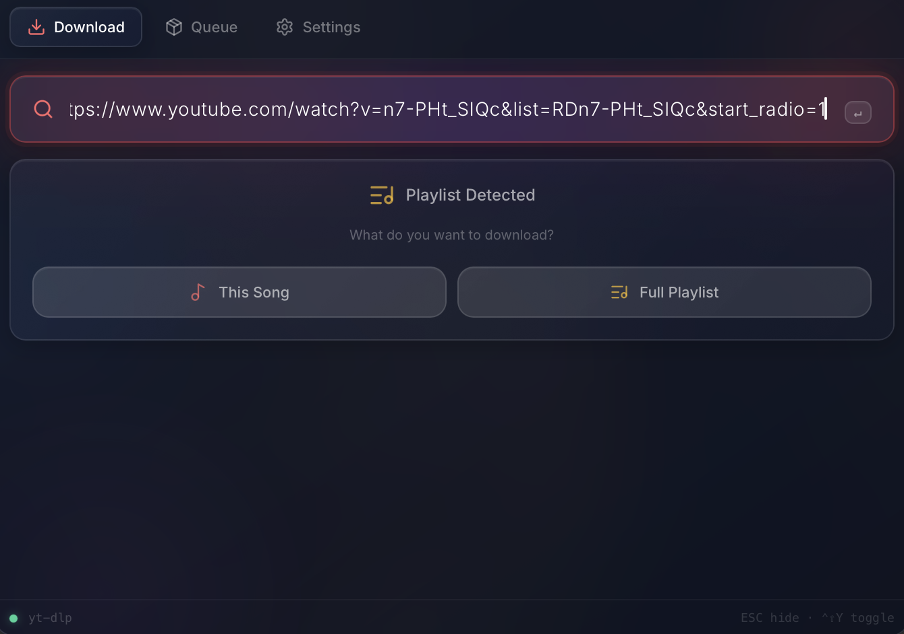
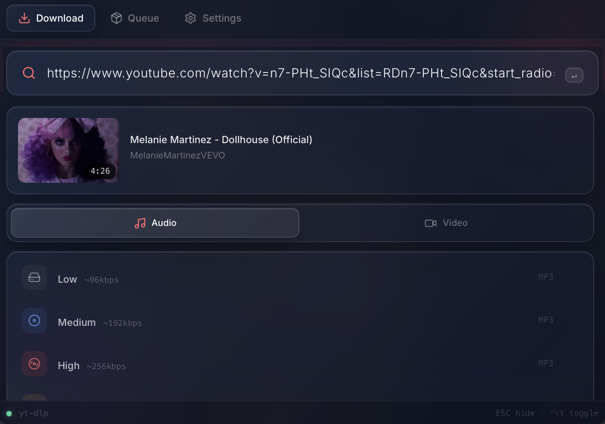
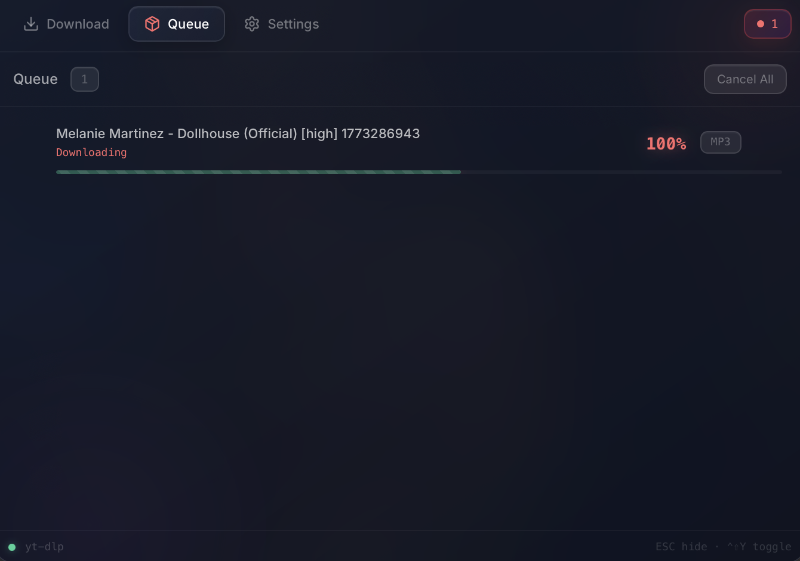
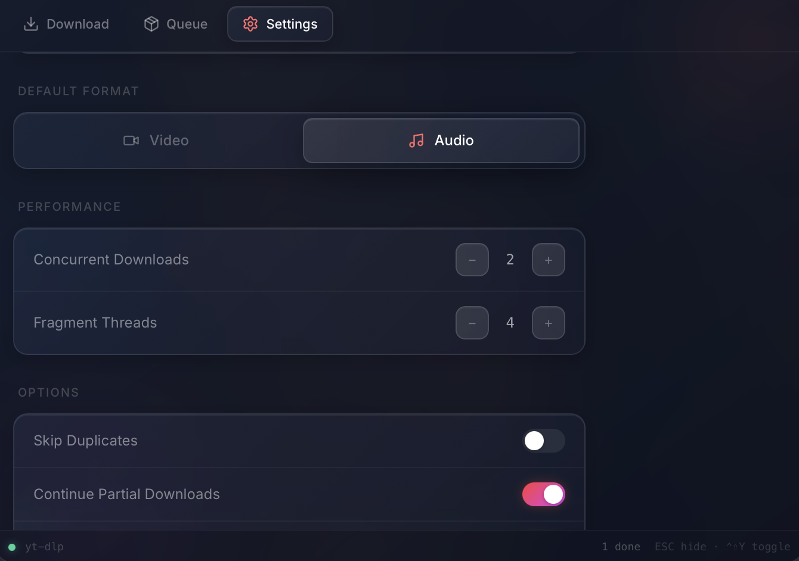

<p align="center">
  
</p>

<h1 align="center">GoTube Downloader</h1>

<p align="center">
  <strong>The YouTube downloader that lives in your menu bar.</strong><br/>
  Paste a link. Pick quality. Done.
</p>

<p align="center">
  <a href="https://github.com/jpastorm/GotubeDownloader/releases">
    
  </a>
  
  
  
</p>

<p align="center">
  
  
  
  
</p>

<p align="center">
  <a href="#install">Install</a> •
  <a href="#quick-start">Quick Start</a> •
  <a href="#features">Features</a> •
  <a href="#settings">Settings</a> •
  <a href="#tech-stack">Tech Stack</a> •
  <a href="#contributing">Contributing</a>
</p>

---

## 🎬 What is GoTube?

GoTube is a **tiny, fast, beautiful** YouTube downloader that sits in your system tray. No bloated Electron app. No browser extensions. No ads. Just paste and download.

- ⚡ **2-second workflow** — paste URL, press Enter, done
- 🎨 **Glassmorphism UI** — dark, sleek, minimal
- 📦 **Lightweight** — ~15MB native binary, not 200MB Electron
- 🔒 **Privacy first** — no accounts, no tracking, runs 100% locally

---

## ✨ Preview

<p align="center">
  
  <br/>
  <em>Pick quality & format — video or audio</em>
</p>

<p align="center">
  
  <br/>
  <em>Video info at a glance — thumbnail, title, duration</em>
</p>

<p align="center">
  
  <br/>
  <em>Download queue with real-time progress, speed & ETA</em>
</p>

<p align="center">
  
  <br/>
  <em>All your settings in one place</em>
</p>

---

## 🚀 Features

<table>
<tr>
<td width="50%">

### ⚡ Lightning Fast
- **Enter** = instant download, zero waiting
- **Paste** = auto-analyze with thumbnail preview
- Fire-and-forget — start downloads while browsing

### 🎵 Video & Audio
- Download as **MP4** (video) or **MP3** (audio)
- Quality: Low · Medium · High · Source
- Switch mode per-download or set a default

### 📋 Smart Playlists
- Auto-detects playlist URLs
- Choose **"This Song"** or **"Full Playlist"**
- All entries download at your chosen quality

</td>
<td width="50%">

### 🏷️ Embed Metadata
- Thumbnail embedded in the file
- Title, artist, date, description
- Chapters (if the video has them)
- Your MP3s look great in music players

### 📥 Download Queue
- Concurrent downloads with progress bars
- Real-time speed & ETA
- Cancel, retry, re-download, open in Finder

### 🔧 Fully Configurable
- Download directory, speed limits, proxy
- Subtitle download & embed
- Skip duplicates, continue partial downloads
- Native macOS notifications

</td>
</tr>
</table>

---

## 💻 Install

### Download

> 🔜 **Releases coming soon** — for now, build from source.

### Build from Source

**Prerequisites:** [Go 1.22+](https://go.dev/dl/) · [Node.js 18+](https://nodejs.org/) · [Wails CLI v2](https://wails.io/docs/gettingstarted/installation)

```bash
# Install Wails
go install github.com/wailsapp/wails/v2/cmd/wails@latest

# Clone & build
git clone https://github.com/jpastorm/GotubeDownloader.git
cd GotubeDownloader
wails build
```

**Output:**
| Platform | Path |
|----------|------|
| macOS | `build/bin/GotubeDownloader.app` |
| Windows | `build/bin/GotubeDownloader.exe` |
| Linux | `build/bin/GotubeDownloader` |

> **First launch** automatically downloads `yt-dlp`. Just make sure `ffmpeg` is available on your system.

---

## 🎯 How to Use

```
1. Launch → app hides in your menu bar / system tray
2. Click tray icon (or press Ctrl+Shift+Y)
3. Paste a YouTube URL
4. Pick quality → done!
```

### Keyboard Shortcuts

| Shortcut | Action |
|----------|--------|
| `Ctrl+Shift+Y` | Toggle window (global hotkey) |
| `Enter` | Instant download at source quality |
| `Enter` while analyzing | Skip analysis → download now |
| `Paste` | Auto-analyze URL |

### Playlist Flow

When you paste a URL with `list=` or `/playlist`:

```
┌──────────────────────────────────┐
│     🎵 Playlist Detected         │
│                                  │
│  ┌────────────┐ ┌──────────────┐ │
│  │ This Song  │ │ Full Playlist│ │
│  └────────────┘ └──────────────┘ │
└──────────────────────────────────┘
         │                 │
         ▼                 ▼
   Analyze one      Analyze all
   → pick quality   → pick quality
   → download       → batch download
```

---

## ⚙️ Settings

All config lives at `~/.gotubedownloader/config.json`

| Setting | Default | What it does |
|---------|---------|-------------|
| 📁 Download Directory | `~/Downloads/GotubeDownloader` | Where files go |
| 🎬 Default Mode | Video (MP4) | Video or Audio |
| ⚡ Concurrent Downloads | 2 | Parallel downloads (1–8) |
| 🧵 Fragment Threads | 4 | Fragments per download (1–16) |
| 🚫 Skip Duplicates | On | Don't re-download same video |
| ⏸️ Continue Partial | On | Resume interrupted downloads |
| 🏷️ Embed Metadata | Off | Thumbnail + metadata + chapters |
| 📝 Download Subtitles | Off | Save subtitle files |
| 💬 Embed Subtitles | Off | Embed subs in video |
| 🌐 Subtitle Language | `en` | Preferred sub language |
| 🔔 Notify on Complete | On | macOS notification |
| 🏎️ Speed Limit | — | e.g. `5M` for 5 MB/s |
| 🌍 Proxy | — | e.g. `socks5://127.0.0.1:1080` |

---

## 🏗️ Tech Stack

<p align="center">
  
  
  
  
  
</p>

| Component | Technology |
|-----------|-----------|
| Backend | Go 1.24 + [Wails v2](https://wails.io) |
| Frontend | Vue 3 + Pinia + Tailwind CSS 3 |
| Icons | [Lucide](https://lucide.dev) |
| macOS Tray | Native Cocoa (NSStatusItem via CGo) |
| Win/Linux Tray | [energye/systray](https://github.com/nicedoc/energye-systray) |
| Hotkey | [golang.design/x/hotkey](https://github.com/nicedoc/golang-design-hotkey) |
| Downloads | [yt-dlp](https://github.com/yt-dlp/yt-dlp) |
| Media Processing | [ffmpeg](https://ffmpeg.org) |

---

## 🌍 Cross-Platform

GoTube is built primarily for **macOS** but runs on all platforms:

| | macOS | Windows | Linux |
|--|-------|---------|-------|
| System Tray | ✅ Native Cocoa | ✅ systray | ✅ systray |
| Hidden from Dock | ✅ | ❌ | ❌ |
| Global Hotkey | ✅ | ✅ | ⚠️ X11 only |
| Transparency | ✅ Vibrancy | ✅ WebView2 | ❌ |
| Notifications | ✅ | — | — |

> ⚠️ **Linux + Wayland:** The global hotkey (`Ctrl+Shift+Y`) requires **X11**. It won't work on Wayland-only sessions.

---

## 📁 Project Structure

<details>
<summary>Click to expand</summary>

```
GotubeDownloader/
├── app.go                          # Wails bindings: analysis, downloads, settings
├── main.go                         # App init, window config, platform options
├── shell.go                        # Embedded icons, overlay show/hide
├── shell_tray_darwin.go            # macOS tray (CGo + Cocoa)
├── shell_tray_other.go             # Windows/Linux tray (energye/systray)
├── shell_hotkey_darwin.go          # Global hotkey (macOS)
├── shell_hotkey_other.go           # Global hotkey (Windows/Linux)
├── tray_darwin.m                   # Objective-C: NSStatusItem
├── icon.png                        # App icon
├── internal/
│   ├── bootstrap/bootstrap.go      # Auto-download yt-dlp, detect ffmpeg
│   ├── config/config.go            # JSON config persistence
│   ├── downloader/
│   │   ├── downloader.go           # yt-dlp wrapper, progress parsing
│   │   └── queue.go                # Concurrent download queue
│   └── history/history.go          # Download history
├── frontend/src/
│   ├── views/
│   │   ├── HomeView.vue            # URL input, analysis, playlist choice
│   │   ├── QueueView.vue           # Download queue + actions
│   │   └── SettingsView.vue        # Settings UI
│   ├── components/
│   │   ├── URLInput.vue            # Smart input (paste=analyze, enter=download)
│   │   ├── AnalysisResult.vue      # Video preview + quality picker
│   │   ├── DownloadQueue.vue       # Queue list
│   │   ├── DownloadItem.vue        # Queue item with progress
│   │   └── BootstrapScreen.vue     # First-run setup
│   └── stores/
│       ├── downloads.js            # Download state & actions
│       └── settings.js             # Settings state
└── build/
    ├── darwin/                     # Info.plist, .icns
    └── windows/                    # manifest, icon
```

</details>

---

## 🤝 Contributing

Contributions are welcome! Feel free to:

1. Fork the repo
2. Create a feature branch (`git checkout -b feature/cool-stuff`)
3. Commit your changes (`git commit -m 'Add cool stuff'`)
4. Push to the branch (`git push origin feature/cool-stuff`)
5. Open a Pull Request

---

## 📄 License

MIT — do whatever you want with it.

---

<p align="center">
  Made with ❤️ by <a href="https://github.com/jpastorm"><strong>jpastorm</strong></a>
</p>

<p align="center">
  <sub>If you find this useful, give it a ⭐ — it helps a lot!</sub>
</p>
